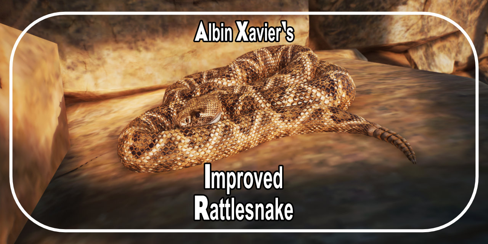

<h1 align="center">
  
</h1>

  Improved Rattlesnake
   
  <a href="#about"><strong>Explore the screenshots »</strong></a>
   
   
  <a href="https://github.com/Albin-Xavier/PZ-Improved-Rattlesnake/issues/new?assignees=&labels=bug&template=01_BUG_REPORT.md&title=bug%3A+">Report a Bug</a>
  ·
  <a href="https://github.com/Albin-Xavier/PZ-Improved-Rattlesnake/issues/new?assignees=&labels=enhancement&template=02_FEATURE_REQUEST.md&title=feat%3A+">Request a Feature</a>
  .
  <a href="https://github.com/Albin-Xavier/PZ-Improved-Rattlesnake/issues/new?assignees=&labels=question&template=04_SUPPORT_QUESTION.md&title=support%3A+">Ask a Question</a>

 

Table of Contents

- [About](#about)
  - [Built With](#built-with)
- [Getting Started](#getting-started)
  - [Prerequisites](#prerequisites)
  - [Installation](#installation)
- [Usage](#usage)
- [Roadmap](#roadmap)
- [Support](#support)
- [Contributing](#contributing)
- [Authors & contributors](#authors--contributors)
- [License](#license)
- [Acknowledgements](#acknowledgements)

---

## About

This mod renovates the Western Diamondback Rattlesnake from Planet Zoo. It has a stronger, thicker body, and a fiercer looking face to match! This beautiful yet fearsome devil of the desert will bring a powerful presence to your zoo! 

Screenshots

 

|                                   Column A                                   |                                   Column B                                |
| :--------------------------------------------------------------------------: | :-----------------------------------------------------------------------: |
|    | |
|    | |
|    | |
|    | |
|    | |

### Built With

- [Cobra Tools](https://github.com/OpenNaja/cobra-tools) - Editing .ovl & .ms2 files.
- [Blender](https://www.blender.org/) - Models

## Getting Started

### Prerequisites

- Legally purchased copy of Planet Zoo.

### Installation

First, make sure you Planet Zoo installed. Once installed, by default your Planet Zoo game directory is located at the following folder: \*C:\Program Files\Steam\steamapps\common\Planet Zoo\*\
If you have installed the game to a custom directory, the game will be located in \*steamapps\common\Planet Zoo\* within your custom installation directory.

The mod is included as a .ovl file to be used in Planet Zoo. Extract the contents of the .zip file to win64 within the game directory. As an alternative, the .zip is packaged for easy installation using [Vortex](https://www.nexusmods.com/about/vortex/)

## Usage

Once installed, the mod will be immediately visible in your game! Take care, and please do enjoy it!

## Roadmap

See the [open issues](https://github.com/Albin-Xavier/PZ-Improved-Rattlesnake/issues) for a list of proposed features (and known issues).

- [Top Feature Requests](https://github.com/Albin-Xavier/PZ-Improved-Rattlesnake/issues?q=label%3Aenhancement+is%3Aopen+sort%3Areactions-%2B1-desc) (Add your votes using the 👍 reaction)
- [Top Bugs](https://github.com/Albin-Xavier/PZ-Improved-Rattlesnake/issues?q=is%3Aissue+is%3Aopen+label%3Abug+sort%3Areactions-%2B1-desc) (Add your votes using the 👍 reaction)
- [Newest Bugs](https://github.com/Albin-Xavier/PZ-Improved-Rattlesnake/issues?q=is%3Aopen+is%3Aissue+label%3Abug)

## Support

Reach out to the maintainer at one of the following places:

- [GitHub issues](https://github.com/Albin-Xavier/PZ-Improved-Rattlesnake/issues/new?assignees=&labels=question&template=04_SUPPORT_QUESTION.md&title=support%3A+)
- Contact options listed on [this GitHub profile](https://github.com/Albin-Xavier)

## Contributing

First off, thanks for taking the time to contribute! Contributions are what make the open-source community such an amazing place to learn, inspire, and create. Any contributions you make will benefit everybody else and are **greatly appreciated**.

Please read [our contribution guidelines](docs/CONTRIBUTING.md), and thank you for being involved!

## Authors & contributors

The original setup of this repository is by [Albin](https://github.com/Albin-Xavier).

For a full list of all authors and contributors, see [the contributors page](https://github.com/Albin-Xavier/PZ-Improved-Rattlesnake/contributors).

## License

This project is licensed under the **Creative Commons Attribution 4.0 License**.

See [LICENSE](LICENSE) for more information.

## Acknowledgements

- [The Amazing GitHub Template](https://github.com/dec0dOS/amazing-github-template), which was used to create this documentation.
